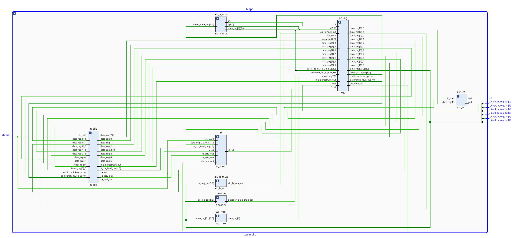
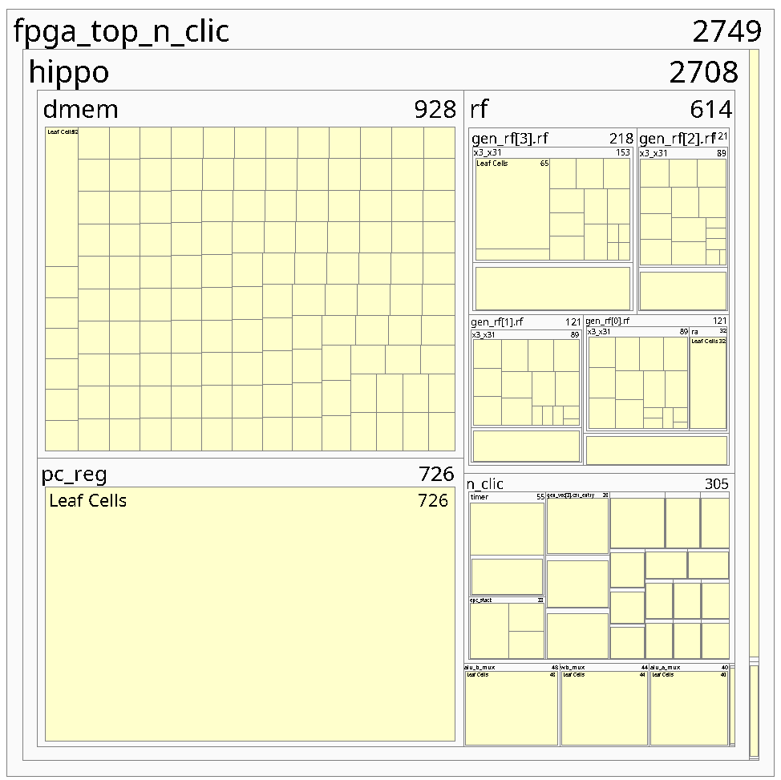
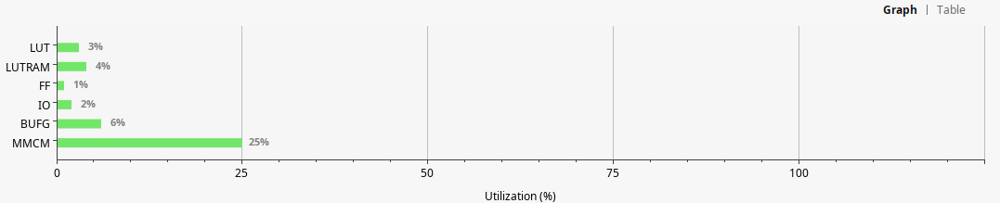
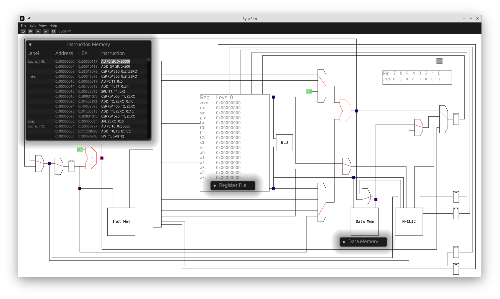
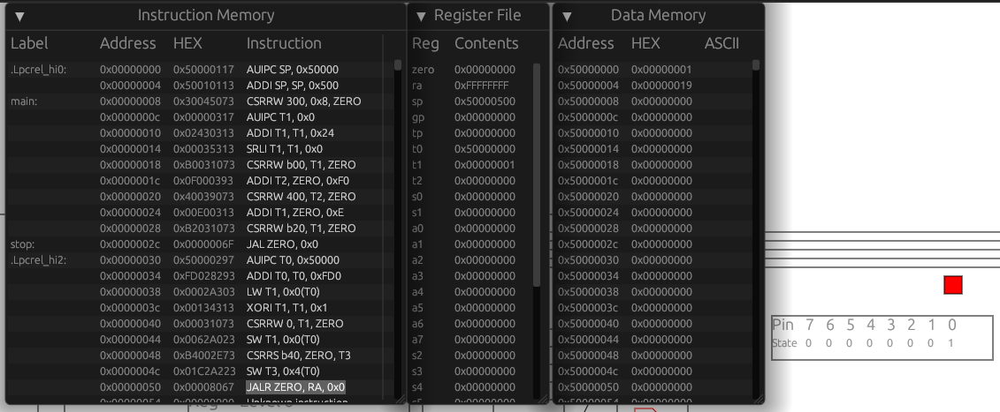
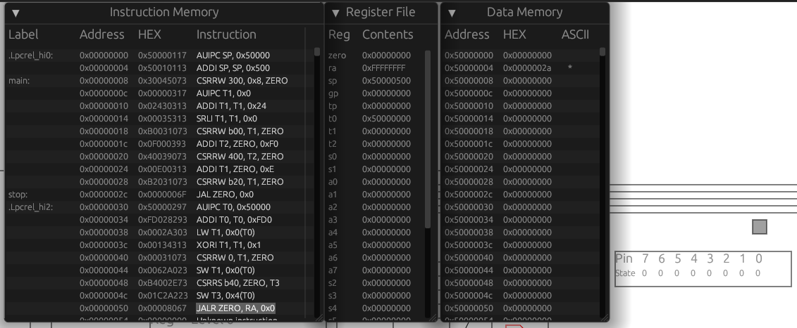

# Hippomenes, in love with Atalanta

Experimental RISC-V RT extension implementation.

Welcome to the [RISC-V RT](https://discord.gg/4KZUqZ29mq) Discord server for discussions/suggestions etc.

Architectural design follows the submitted proposal (contact <per.lindgren@ltu.se> for pre-print).
The design goal of RISC-V RT is to provide a specification for light-weight MCU implementations enabling the implementation of (hard) real-time systems. RISC-V RT currently features:

- N-CLIC
  - zero-latency interrupt selection and dispatch
  - zero-overhead interrupt execution (handler run as normal function)
  - zero-latency tail-chaining
- Hardware time stamping
  - cycle accurate monotonic timer
  - configurable pre-scaler
  - configurable precision
- CSR mapped registers (thus the overhead of MMIO accesses eliminated)
- Timer peripheral
  - cycle accurate
  - configurable pre-scaler
- Example GPIO
  - Led-array indicating set condition

Design elements are scaled with the selected number of priority levels, thus allowing to trade scheduling flexibility against hardware implementation cost.

The design acts a reference implementation for the RISC-V RT extension, and should be consider the specification.

## Versioning

The design follows semantic versioning (regarding expected behavior) along the triple, $x.y.z$:

- $x$, major version, indicates breaking API changes (requires update of run-time system and in cases applications)
- $y$, minor version, indicates backwards compatible feature additions. Run-time system/application updates required only for leveraging added features.
- $z$, patch level, indicates backwards compatible changes, e.g., bug-fixes, and non-user facing improvements to the implementation such internal names, tests, and synthesis flow.

As the RISC-V RT (and its reference implementation) is not yet considered feature complete:

- $0$, major version is zero
- $y$, indicates breaking API changes (requires update of run-time system and in cases applications)
- $z$, indicates backwards compatible feature additions. Run-time system/application updates required only for leveraging added features as well as patch level.

See [CHANGELOG.md](/CHANGELOG.md) for current status.

## Structure

The repository is structured as follows:

- `fpga`, backend workflow (currently targeting Vivado/Xilinx Pynq-Z1, more targets will follow)
- `hdl`
  - `src`, general top level sources and test benches
    - `core`, Hippomenes specific sources and test benches
  - `verilator`, simulation setup.

## Simulation

The design can be simulated using the Verilator tool, see [Simulation](/hdl/verilator/README.md).

See below [Example](#example)

## Synthesis

The design can be synthesized to the entry level Pynq-Z1 platform using the Vivado tool, see [Synthesis](/fpga/README.md).

Hippomenes RTL at top level:



Resource usage for a configuration with 4 priority levels (as the ARM Cortex M0) and 4K of SRAM is depicted below:

The data memory (`dmem`) stands for the majority of the required resources, while the stacked register file (`rf`) and (`n-clic`) together amounts to a third of the resources used.



Looking closer at the resource utilization:


And in comparison to resources available for the entry level Pynq-Z1:



Interesting here is that the total design amounts to less than 4 percent of the logic resources, thus the design can be considered ultra light-weight.

This is also reflected by the modest synthesis time, less than 2 minutes for a clean build flow (synthesis, implementation, bitmap generation and target deployment) on a standard desktop (Amd-7950x3d, 32 gig-ram, running arch linux 6.9 and Vivado 2023-2). (Iterative builds are typically faster.)

## Prototyping

The RISC-RT and its implementation has been modelled using the [SyncRim](https://github.com/perlindgren/syncrim/tree/hippomenes) tool. The high-level SyncRim model and its implementation is in 1-1 functional correspondence, thus providing an interactive, cycle accurate, high-level simulation model of the proposed RISC-V RT specification.



## Example

The below example showcase prominent features of the RISC-V RT, and the Hippomenes reference implementation:

```risc-v
            .option  norvc
            .text
init:       la      sp, _stack_start        # set stack pointer
main:       csrwi   0x300, 8                # enable global interrupts
            la      t1, isr_0
            srl     t1, t1, 2
            csrw    0xB00, t1               # setup isr_0 address

            li      t2, 0b11110000          # interrupt every 16 cycles, cmp value 0b1111 = 15, prescaler 0b0000                                           
            csrw    0x400, t2               # timer.counter_top CSR
            la t1,  0b1110                  # priority 0b11, enable, 0b1, pend 0b0
            csrw    0xB20, t1               # write above to interrupt 0 (timer interrupt)
stop:       j       stop                    # wait for interrupt

isr_0:      la      t0, .toggled            # &static mut toggled state
            lw      t1, 0(t0)               # deref toggled
            xori    t1, t1, 1               # toggle bit 0
            csrw    0x0, t1                 # set bit 0 (t1 = 1) in GPIO CSR (LED on/off)
            sw      t1, 0(t0)               # store toggled value
            csrr    t3, 0xB40               # read captured timestamp
            sw      t3, 4(t0)               # store timestamp
            jr      ra                      # return 

            .data
.toggled:   .word   0x0                     # state
            .word   0x0                     # time-stamp
```

The run-time (`.init`) for this case is a single instruction to setup the (shared) stack pointer. The application (`.main`) starts by enabling global interrupts (`0x300`), setting up the interrupt vector address (`0xb00`) for `isr_0` (the vector table does not store the two least significant bits so we shift right by 2). We then configure the timer peripheral (`x400`) to generate an interrupt each 15 cycles. Finally we configure the interrupt control (`xb20`), setting priority to 3, and the enable bit to 1, and wait in a busy loop for interrupts to occur.

The interrupt handler (`isr_0`) reads the local resource (`.toggled`), toggles bit 0, updates the gpio (`0x0`) and stores the toggled value back to the local resource. It then reads the timestamp the interrupt (`0xB40`) and stores that to the local resource.

A SyncRim simulation is show below:


At the end of the `isr_0`, the register `ra` has the value `0xFFFFFFFF` indicating to the `n-clic` to return to the preempted task (`.stop` in this case). The `.toggled.led_state` is `00000001` (as indicated by the LED bit 0 being lit red). The `.toggled.timestamp` value is `00000019`, indicate the *global* monotonic time when the interrupt was captured.

State at next interrupt return is shown below:

At this point we see that the `.toggled.led_state` is `00000000` (as indicated by the LED bit 0 being grey). The `.toggled.timestamp` value is `0000002a`, indicate the *global* monotonic time when the interrupt was captured. The timer re-load has for this implementation a latency of 1.

### HDL Simulation

The same program as run using the Verilator test-bench shows:


To the left the set of signals to view is shown, for this example the `reset`, `clk`, `pc` `instruction` and `n_clic_interrupt`. The cursor is placed at the entry of the second timer interrupt. We can observe that there is exactly 16 clock cycles between interrupts. (The observant reader also observes that the first timer interrupt is taken directly after initialization, wether this is a desired behavior can be debated, but it is in our hands to specify and implement as we see fit!)

## System Verilog implementation

CSRs underlies all peripheral implementations (the internal `n_clic` and external `timer` and `gpio`). As an example of simplicity, the peripheral is implemented in [timer.sv](./hdl/src/core/timer.sv), inlined here in its entirety.

```verilog
// timer
`timescale 1ns / 1ps

//  Programmable timer peripheral
module timer
  import config_pkg::*;
  import decoder_pkg::*;
(
    input logic clk,
    input logic reset,

    input logic    csr_enable,
    input CsrAddrT csr_addr,
    input csr_op_t csr_op,
    input r        rs1_zimm,
    input word     rs1_data,
    input TimerT   ext_data,
    input logic    ext_write_enable,
    input logic    interrupt_clear,

    output logic interrupt_set,
    output word  csr_direct_out,
    output word  csr_out
);
  TimerWidthT counter;
  TimerT timer;

  csr #(
      .CsrWidth(TimerTWidth),
      .Addr(TimerAddr)
  ) csr_timer (
      // in
      .clk,
      .reset,

      .csr_enable,
      .csr_addr,
      .csr_op,
      .rs1_zimm,
      .rs1_data,

      // external access for side effects
      .ext_data,
      .ext_write_enable,
      // out
      .direct_out(csr_direct_out),
      .out(csr_out)
  );

  assign timer = csr_timer.data;

  always_ff @(posedge clk) begin
    if (reset) begin
      counter <= 0;
      interrupt_set <= 0;
    end else begin
      if (timer.counter_top << timer.prescaler == counter) begin
        $display("counter top: counter = %d", counter);
        counter <= 0;
        interrupt_set <= 1;
      end else begin
        if (interrupt_clear) interrupt_set <= 0;
        counter <= counter + 1;
      end
    end
  end

endmodule
```

As seen it instantiates a single CSR, which address (`TimerAddr`) and layout (`TimerT) is defined in the [config_pkg.sv](hdl/src/config_pkg.sv).

```verilog
  localparam CsrAddrT TimerAddr = 'h400;

  // Peripheral timer
  localparam TimerWidth = 16;
  localparam TimerPreWith = 4;

  localparam type TimerWidthT = logic [TimerWidth-1:0];
  localparam type TimerPresWidthT = logic [TimerPreWith-1:0];

  typedef struct packed {
    TimerWidthT counter_top;
    TimerPresWidthT prescaler;  // LSB
  } TimerT;
```

As seen there is currently just a `counter_top` and `prescaler` (we kept it simple). As a side effect, the `timer` has in Verilator simulation the reset value 0, thus a match to the `counter` register will happen immediately after reset, the `interrupt_set` goes high, and and the interrupt is dispatched by the `n_clic` as soon as the corresponding enable bit in the vector table is set.

## AMD/Xilinx Zynq/Artix 7000 series and the Pynq Z1

HDL sources are written in synthesis friendly SystemVerilog. The design is kept minimal, as reported by `cloc` the core is about 1k-loc with another 1k-loc of test-benches (one for each component). Top level includes data and instruction memory, where XPM-SPRAM (Xilinx proprietary single ported block-ram) is used by Vivado for synthesis for both simulation and synthesis of the instruction memory. This allows post-synthesis updates of memory content, without re-synthesis (vastly improving code-change iterations). (`Verilator` based simulation uses a simpler rom model with the same functionality). Timing is met at approximately 50MHz which is surprisingly good for a single cycle/non-pipelined design (no backend tuning has been applied). During development it is however recommended to target lower frequencies to improve synthesis iterations, a full iteration cycle (synthesis, implementation and bitstream generation) is well under 2 minutes at 20MHz on a standard desktop (AMD 7950x3d 32G ram, Vivado 2023.2).

A single file `config_pkg.sv` is used to configure Hippomenes, defaulting to a light-weight configuration with 4 interrupt priorities and 8 interrupt vectors.

Top level defines the interface to the environment, currently:

- 4 LEDs for status indication (led0, bound to clock)
- 2 Switches, SW0 tied to external clock reset, SW1 tied to internal soft reset. Additional interfaces can be straightforwardly added.

The released version does not ship with any ILA/DGB blocks activated, as their use is very much feature specific.

## Rust Examples

In line with requirements to memory safety, Hippomenes is leveraging on the Rust language and ecosystem. The only pre-requisite is a working Rust tool-chain. The Rust tooling is fully integrated with the Pynq-Z1 target, offering dfu like programming with iterations (source code updates to code deployed) in less than 15 seconds. Jtag debug functionality and [probe-rs](https://probe.rs/) is planned.

## Contribution

RISC-V RT draws on the success of the Rust project in allowing both progression and stability at the same time through semantic versioning.

The RISC-V RT specification is open for You and everybody else. Fork the project, make changes and open an issue/PR. If/when your PR is eventually merged, it IS the specification of RISC-V RT associated to its semantic version.

This is very different from the [riscv.org](https://riscv.org/), where the specification lacks a reference implementation and might or might not make sense in practice. RISC-V RT on the other hand requires you to implement it, and come up with examples and tests that showcase its use and correctness. It allows for an agile development process, the [CLIC spec](https://github.com/riscv/riscv-fast-interrupt/) specification has been in flux since 2018 (more than 6 years) without ratification.

The exact form of Contributions is not yet defined, please suggest the form you would prefer in [Issue 3](https://github.com/perlindgren/hippomenes/issues/3).

## License

To be determined, contact <per.lindgren@ltu.se> for licensing questions. Please suggest in [Issue 2](https://github.com/perlindgren/hippomenes/issues/2) what You think is the best license for the project.
